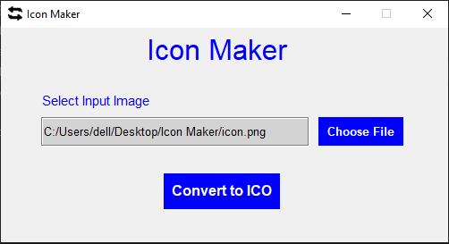

# Icon-Maker-GUI [](https://forthebadge.com)

[](https://github.com/insanecodes/Icon-Maker-GUI)
[](https://github.com/insanecodes/Icon-Maker-GUI/fork)
<br>
A Icon Maker GUI Made Using Python 3.9.0 .<br>
It will take any image and convert it to ICO file, for web site favicon or Windows applications.<br>
Hope You Will Like It and you can also use the code to make your own version.

>#### To Run, simply open your terminal and go the source directory and type ``python main.py``.
>- Click on 'Choose File' button and pick any image from any location.
>- Select the 'Convert to ICO' button and pick the location where the file will be saved.
## Requirements
1.  Pillow
2.  Os
3.  Tkinter

---

### Installing The Pillow Module:
* For Linux: Open Terminal then type ```pip3 install Pillow```
* For Windows: Open CMD, then type ```pip install Pillow```


---
## Demo


<div align="center">

### Show some ❤️ by starring the repository!

</div>
